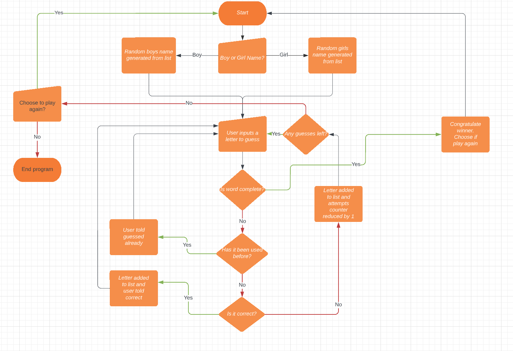
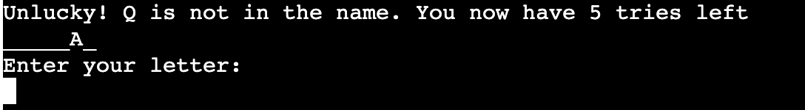
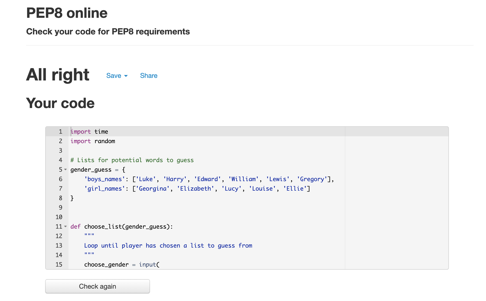
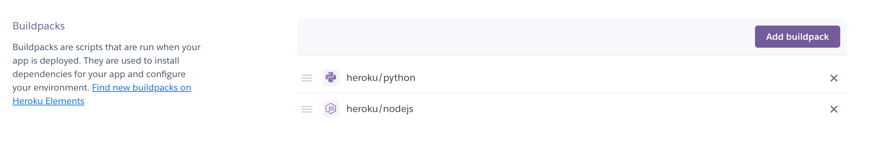
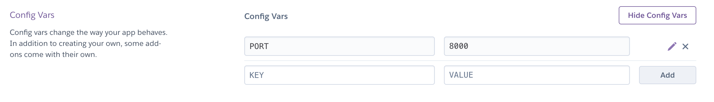
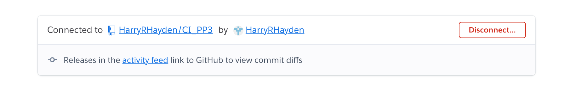
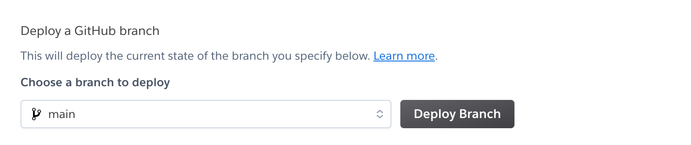

# Hangman

Hangman is a letter based guessing game where the player has a limited number of tries to guess a word by choosing a single letter at a time. If the player guesses a correct letter then they continue being allowed to guess further letters. If they guess an incorrect letter their number of attempts is decreased. The object of the game is to guess all the letters contained in a word to spell the entire name without losing all of your lives.

[Live Webpage](https://ci-pp3.herokuapp.com/)

1. [Project Goals](#project-goals)
    1. [User Goals](#user-goals)
    2. [Site Owner Goals](#site-owner-goals)
2. [User Experience](#user-experience)
    1. [Target Audience](#target-audience)
    2. [User Requirements and Expectations](#user-requirements-and-expectations)
    3. [User Stories](#user-stories)
3. [Style Choices](#style-choices)
    1. [Design](#design)
    2. [Colour](#colour-scheme)
    4. [Structure](#structure)
    5. [Initial Framework](#initial-framework)
4. [Technologies Used](#technologies-used)
    1. [Languages](#languages)
    2. [Frameworks & Tools](#frameworks-and-tools)
5. [Features](#features)
6. [Testing](#testing)
    1. [Manual Testing](#manual-testing)
    5. [Device testing](#perform-test-on-devices)
    6. [Browser compatibility](#browser-compatability)
    7. [Testing user and owner goals](#testing-user-and-owner-goals)
7. [Validation](#validator-testing)
    1. [HTML](#html)
    2. [CSS](#css)
    3. [Lighthouse](#lighthouse-score)
    4. [Accessibility](#accessibility)
    5. [JavaScript](#javascript)
8. [Bugs Fixed](#bugs-fixed)
9. [Deployment](#deployment)
10. [Credits](#credits)
    1. [Content](#content)
    2. [Media](#media)

## Project Goals

### User Goals

1. 

### Site Owner Goals

## User Experience

### Target Audience

- People wanting to play an online game
- People with spare time and access to a computer
- People who enjoy logical quizzes
- People who enjoy guessing games

### User Requirements and Expectations

- 

### User Stories

- 

### Structure

### Initial Framework

Before starting the website I used a flowchart design tool called [Lucid Charts](https://www.lucidchart.com/pages/?gclid=CjwKCAjw46CVBhB1EiwAgy6M4skl7mbVGiSXGMSUR3JqHjJwMkf6B20PcSZEtb7117jRiZALYDWdKBoCk-wQAvD_BwE&km_CPC_AdGroupID=55688909257&km_CPC_AdPosition=&km_CPC_CampaignId=1490375427&km_CPC_Country=1006800&km_CPC_Creative=354596043016&km_CPC_Device=c&km_CPC_ExtensionID=&km_CPC_Keyword=lucid%20chart&km_CPC_MatchType=e&km_CPC_Network=g&km_CPC_TargetID=kwd-55720648523&km_CPC_placement=&km_CPC_target=&utm_campaign=_chart_en_tier1_mixed_search_brand_exact_&utm_medium=cpc&utm_source=google) to mockup a flow of information.

Lucid Chart

## Technologies Used

### Languages
- Python

### Frameworks and Tools
- Git
- GitHub
- Gitpod
- Paint.NET
- Lucid Chart
- Heroku

## Features
### Existing Features

- __Choice of boys name or girls name__

  - The user can decide which gender of name they wish to guess

  

- __Good luck message__

  - The user is displayed a good luck message

  

- __Word shown as underscores__

  - The user is displayed a the word with the letters replaced by '_' to show the length of the word

  

- __Enter a letter area__

  - The user is displayed an 'enter a letter' phrase and an area to enter said letter

  

- __Invalid entry__

  - The user is displayed a message to advise of an invalid entry when a letter is not the input

  

- __Duplicated guess__

  - The user is displayed a message to advise they have already tried to guess that letter

  

- __Correct guess__

  - The user is displayed a message to advise they have correctly guessed a letter. With the underscore transforming into the guessed letter where applicable

  

- __Incorrect guess__

  - The user is displayed a message to advise they have been unsuccessful at guessing a letter

  

- __Tries counter__

  - The user has a limited number of guesses which is displayed when an incorrect letter is guessed

  

### Features Left to Implement

- Add a username 

## Testing 

### Perform test on devices
The website was tested on the following devices:
- MacBook Pro
- MacBook

### Browser compatability
The website was tested on the following browsers:
- Chrome
- Safari
- Edge

## Validator Testing 

### Python

Code validation completed by [PEP8](http://pep8online.com/) and returned no errors
    

Python

 

## Bugs Fixed

- Lowercase letter issue
    * When inputting the initial decision for choosing a boy or girl name the if statement was not catching the decision. Utilised the .upper() function in Python to ensure the decision was a capital regardless of user decision
- If statement order of running
    * When checking for if a user had already attempted a guess at that letter the if statement was incorrectly sequenced so the program congratulated the user. By switching the order of checking the if statement catches a previously guessed letter

## Testing User and Owner Goals

1. Ability to play a fun game

| **Feature** | **Action** | **Expected Result** | **Actual Result** |
|-------------|------------|---------------------|-------------------|
| The game itself | Ability to play Rock, Paper, Scissors | Randomised game of Rock, Paper, Scissors against the computer | A playable game |

  

User Goal 1

 

## Deployment

The website was deployed using Heroku by following these steps:
1. Log into [Heroku](https://www.heroku.com/)
2. Select Create New App
3. Name your app and select location
    

Heroku Deployment

 
4. Enter the settings tab. Add the required buildpacks
    

Heroku Deployment Buildpacks

 
5. From the settings tab add the required Config Vars
    

Heroku Deployment Config Vars

 
6. Select the Deploy tab. Connect to your required GitHub repository
    

Heroku Deployment GitHub

 
7. From the Deploy tab scroll to the bottom and select 'Deploy'
    

Heroku Deployment

 

You can for fork the repository by following these steps:
1. Go to the GitHub repository
2. Click on Fork button in upper right hand corner

You can clone the repository by following these steps:
1. Go to the GitHub repository 
2. Locate the Code button above the list of files and click it 
3. Select if you prefer to clone using HTTPS, SSH, or Github CLI and click the copy button to copy the URL to your clipboard
4. Open Git Bash
5. Change the current working directory to the one where you want the cloned directory
6. Type git clone and paste the URL from the clipboard ($ git clone https://github.com/YOUR-USERNAME/YOUR-REPOSITORY)
7. Press the Enter key to create your local clone.

The live link can be found here - https://ci-pp3.herokuapp.com/

## Credits 

### Content 

- The responsive design cover was made using [Am I Responsive?](https://ui.dev/amiresponsive)
- The flow diagram was made using [Lucid Charts](https://www.lucidchart.com/pages/?gclid=CjwKCAjw46CVBhB1EiwAgy6M4skl7mbVGiSXGMSUR3JqHjJwMkf6B20PcSZEtb7117jRiZALYDWdKBoCk-wQAvD_BwE&km_CPC_AdGroupID=55688909257&km_CPC_AdPosition=&km_CPC_CampaignId=1490375427&km_CPC_Country=1006800&km_CPC_Creative=354596043016&km_CPC_Device=c&km_CPC_ExtensionID=&km_CPC_Keyword=lucid%20chart&km_CPC_MatchType=e&km_CPC_Network=g&km_CPC_TargetID=kwd-55720648523&km_CPC_placement=&km_CPC_target=&utm_campaign=_chart_en_tier1_mixed_search_brand_exact_&utm_medium=cpc&utm_source=google)