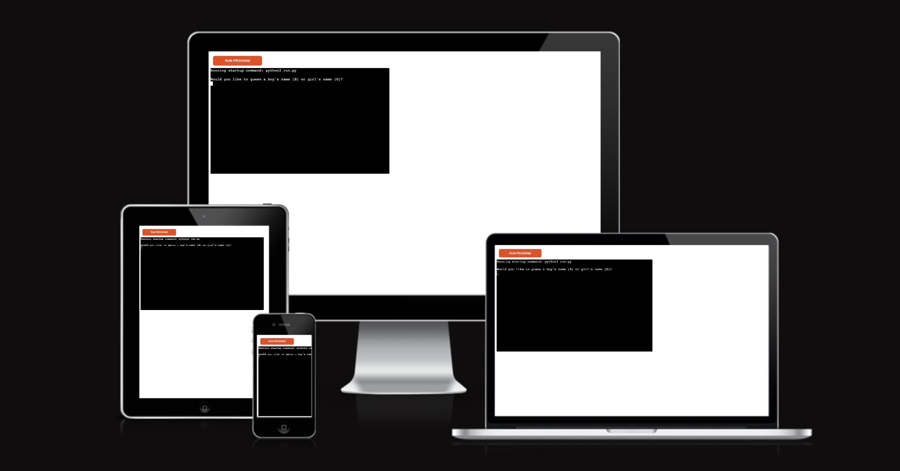
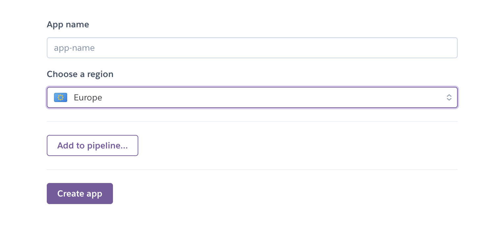

# Hangman

Hangman is a letter based guessing game where the player has a limited number of tries to guess a word by choosing a single letter at a time. If the player guesses a correct letter then they continue being allowed to guess further letters. If they guess an incorrect letter their number of attempts is decreased. The object of the game is to guess all the letters contained in a word to spell the entire name without losing all of your lives.

[Live Webpage](https://ci-pp3.herokuapp.com/)

1. [Project Goals](#project-goals)
    1. [User Goals](#user-goals)
    2. [Site Owner Goals](#site-owner-goals)
2. [User Experience](#user-experience)
    1. [Target Audience](#target-audience)
    2. [User Requirements and Expectations](#user-requirements-and-expectations)
    3. [User Stories](#user-stories)
3. [Style Choices](#style-choices)
    1. [Design](#design)
    2. [Colour](#colour-scheme)
    4. [Structure](#structure)
    5. [Initial Framework](#initial-framework)
4. [Technologies Used](#technologies-used)
    1. [Languages](#languages)
    2. [Frameworks & Tools](#frameworks-and-tools)
5. [Features](#features)
6. [Testing](#testing)
    1. [Manual Testing](#manual-testing)
    5. [Device testing](#perform-test-on-devices)
    6. [Browser compatibility](#browser-compatability)
    7. [Testing user and owner goals](#testing-user-and-owner-goals)
7. [Validation](#validator-testing)
    1. [HTML](#html)
    2. [CSS](#css)
    3. [Lighthouse](#lighthouse-score)
    4. [Accessibility](#accessibility)
    5. [JavaScript](#javascript)
8. [Bugs Fixed](#bugs-fixed)
9. [Deployment](#deployment)
10. [Credits](#credits)
    1. [Content](#content)
    2. [Media](#media)

## Project Goals

### User Goals

1. 

### Site Owner Goals

## User Experience

### Target Audience

- 

### User Requirements and Expectations

- 

### User Stories

- 

### Structure

### Initial Framework

Before starting the website I used a framework design tool called [Balsamic](https://balsamiq.com/) to mockup an initial design idea.

## Technologies Used

### Languages
- Python

### Frameworks and Tools
- Git
- GitHub
- Gitpod
- Paint.NET
- Balsamiq

## Features
### Existing Features

- __Header__

  - 

  

### Features Left to Implement

- Login to save wins/losses

## Testing 

### Perform test on devices
The website was tested on the following devices:
- MacBook Pro
- MacBook 
- iPhone 11
- iPhone 12 Mini
- iPad

In addition, the website was tested using Google Chrome Developer Tools Device Toggling option for all available device options.

### Browser compatability
The website was tested on the following browsers:
- Chrome
- Safari
- Edge

## Validator Testing 

### HTML

## Bugs Fixed

## Testing User and Owner Goals

1. Ability to play a fun game

| **Feature** | **Action** | **Expected Result** | **Actual Result** |
|-------------|------------|---------------------|-------------------|
| The game itself | Ability to play Rock, Paper, Scissors | Randomised game of Rock, Paper, Scissors against the computer | A playable game |

  

User Goal 1

 

## Deployment

The website was deployed using Heroku by following these steps:
1. Log into [Heroku](https://www.heroku.com/)
2. Select Create New App
3. Name your app and select location
    

Heroku Deployment

 

You can for fork the repository by following these steps:
1. Go to the GitHub repository
2. Click on Fork button in upper right hand corner

You can clone the repository by following these steps:
1. Go to the GitHub repository 
2. Locate the Code button above the list of files and click it 
3. Select if you prefer to clone using HTTPS, SSH, or Github CLI and click the copy button to copy the URL to your clipboard
4. Open Git Bash
5. Change the current working directory to the one where you want the cloned directory
6. Type git clone and paste the URL from the clipboard ($ git clone https://github.com/YOUR-USERNAME/YOUR-REPOSITORY)
7. Press the Enter key to create your local clone.

The live link can be found here - 

## Credits 

### Content 

- The responsive design cover was made using [Am I Responsive?](https://ui.dev/amiresponsive)

### Media

- 